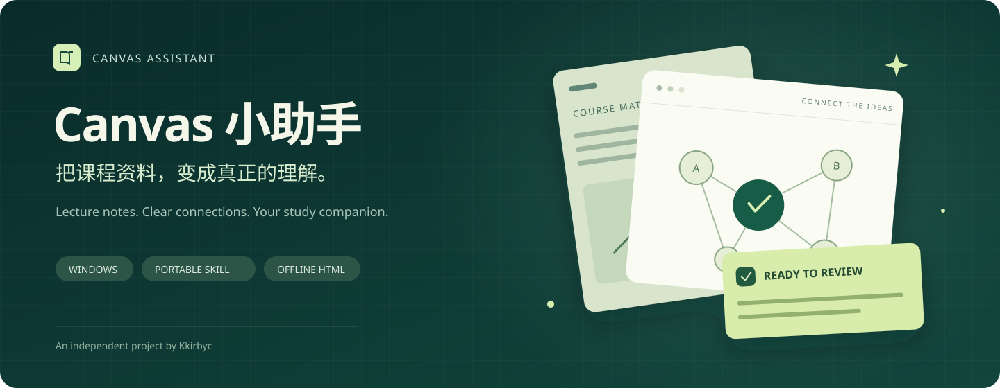

<p align="center">
  
</p>

<p align="center">
  <a href="LICENSE"></a>
  
  <a href="https://github.com/Kkirbyc/Canvas-Assistant/releases"></a>
  
</p>

<p align="center"><strong>让 AI 帮你认真读课，让你把时间花在理解上。</strong></p>
<p align="center">
  <a href="#快速开始">快速开始</a> ·
  <a href="https://github.com/Kkirbyc/Canvas-Assistant/releases">下载安装包</a> ·
  <a href="#兼容范围">兼容范围</a> ·
  <a href="canvas-study/references/setup.md">完整指南</a> ·
  <a href="https://github.com/Kkirbyc/Canvas-Assistant/issues">反馈问题</a>
</p>

## 它能帮你做什么？

**Canvas 小助手**是一套面向 Windows 的通用 AI 学习技能。它让具备本地工具能力的 AI 代理读取你获授权访问的 Canvas LMS 资料，整理成有来源、有原图、可以离线阅读的复习手册。

它不是一套固定课程答案，也不是替你参加考试的工具。

| 读全关键资料 | 看懂知识联系 | 按自己的节奏复习 |
|---|---|---|
| PPT、讲义、公告与可用字幕，逐项记录覆盖情况 | 老师原图配中文解释，保留公式条件、出处与勘误 | 图文 HTML、学习计划与自测，支持搜索、放大和打印 |

### 为真实复习设计

- **先看范围，再读内容。** 默认聚焦讲义、公告和考试相关练习；Lab、PA、项目先预览，询问一次是否纳入。
- **有 API 就复用，没有就走浏览器。** 支持已有 Canvas 连接、GET-only API Reader，以及对应宿主的浏览器流程。
- **普通步骤少打断。** 已授权的读取、提取和生成直接继续；宿主强制审批、凭据保存和删除操作仍需确认。
- **图文资料开箱可读。** 默认交付离线 HTML；保留原图，无法使用时明确标注重建图，不伪造来源。
- **没有读到就明说。** 锁定资料、缺失字幕、尚未发布的答案不会被标成“已读”。
- **考完之后再整理。** 下次相关交互时先提出清理清单，确认后处理下载副本，保留网页依赖。

## 快速开始

### 1. 下载并解压

到 [Releases](https://github.com/Kkirbyc/Canvas-Assistant/releases) 下载预览版 ZIP，**完整解压**，打开 `canvas-study/开始使用.html`。

如果使用 Git：

```powershell
git clone https://github.com/Kkirbyc/Canvas-Assistant.git
cd Canvas-Assistant\canvas-study
```

### 2. 交给你的 AI 工具

将解压路径告诉 Codex、Claude Code 或 OpenClaw：

```text
请阅读这个目录中的 SKILL.md，安装 Canvas 小助手。
先识别我的宿主和现有 API/浏览器能力，复用已有连接。
没有 API 时配置对应浏览器流程，不改变我的全局权限设置。
配置完成后验证工具，再让我亲自登录 Canvas。
```

也可以在 `canvas-study` 目录内使用 PowerShell：

```powershell
# 先预览，再执行。HostName 也可选择 claude、openclaw、generic。
.\setup.ps1 -HostName codex
.\setup.ps1 -HostName codex -Apply
```

安装器会检查 Python，创建用户级文档工具环境；Codex/Claude 的浏览器模式会配置固定版本 Playwright MCP，优先复用 Node 和 Edge，缺少时下载对应运行时/浏览器。**它不安装 AI 宿主，也不配置你的模型订阅。** OpenClaw 优先使用其原生 managed browser，见[宿主适配](canvas-study/references/hosts.md)。

### 3. 本人登录，然后开始复习

重新加载宿主后，由你本人在浏览器完成账号登录和 MFA，再发送：

```text
帮我准备 [课程名] 在 [日期] 的考试，每天可复习 [时长]。
先预览课程，以 PPT、讲义和公告为主。
是否加入 Lab、PA 等内容，请预览后问我一次。
请生成带老师原图、可以离线阅读的 HTML 复习资料。
```

默认数据保存在 `%USERPROFILE%\CanvasStudy`。账号、密码、Token 和 MFA 验证码不要放进聊天、Issue 或本仓库。

> 如果 PowerShell 阻止运行下载的脚本，请先核对来源和校验文件，按[安装指南](canvas-study/references/setup.md)处理下载标记或组织限制；不要关闭整机安全策略。首次安装、网络或浏览器启动可能需要宿主批准，skill 不能绕过这些审批。

## 兼容范围

这是 **Windows 首版预览**，共用学习流程，分别适配工具入口。文档支持不等于所有账户已经端到端实测。

| 环境 | 接入方式 | 当前验证状态 |
|---|---|---|
| Codex | 用户级 skill + API 或 Playwright MCP | Windows 浏览器路径有实用验证；本包安装与 MCP 冒烟测试通过 |
| Claude Code | 用户级 skill + API 或 Playwright MCP | CLI 参数已核对；未做真实课程端到端验证 |
| OpenClaw 原生 Windows Gateway | 用户级 skill + API 或 managed browser | 官方能力/路径已核对；尚未实机端到端验证 |
| Windows Hub + WSL / 远程 Gateway | 需在实际 Gateway 一侧安装和配置 | 提供适配说明；本安装器不自动安装 WSL 或远程节点 |
| 普通网页聊天 / 其他宿主 | 取决于本地工具和技能接入能力 | 不承诺直接安装即用 |

本机验证使用 Windows x64。ARM64、完全空白环境的所有下载分支，以及不同学校的 OAuth/LTI 流程仍需进一步验证。

## 输出是什么样？

复习包包含完整笔记、考试要求、学习计划、来源索引，以及需要说明的资料缺口和勘误。页面支持离线阅读、原图放大、全文检索和打印。

下载仓库或安装包后，可以在浏览器打开：

- `canvas-study/demo/index.html`：**合成图文演示**，不含真实课程资料。
- `canvas-study/开始使用.html`：可直接阅读的安装入口。
- `canvas-study/guide/index.html`：离线完整指引。

GitHub 文件预览不会把 HTML 当网站运行，需要下载后用浏览器打开。首页横幅为本项目原创矢量设计，不是课程截图或官方 Canvas 标识。

## 隐私与边界

- 不提交作业、不启动测验、不代考、不发帖，不收集其他学生名单或作业。
- 不导出日常浏览器 cookie，不自动保存 Token；需要保留登录状态时先单独说明并取得授权。
- API Reader 仅提供受限的读取入口；浏览器过滤层不开放任意代码执行或上传工具。点击仍可能产生网站操作，因此代理仍需遵守读取范围。
- 本仓库及安装包不含课程内容、学生成绩、账号或登录状态。学校和老师材料的权利不因工具开源而改变。
- 考后清理是**主动提出、确认后执行**；不会创建后台提醒，也不会静默删除文件。

## 文档导航

| 文档 | 内容 |
|---|---|
| [标准 SKILL.md](canvas-study/SKILL.md) | 代理读取的完整学习流程 |
| [安装与更新](canvas-study/references/setup.md) | 依赖、安装路径、运行解释器、重载、撤销 |
| [宿主适配](canvas-study/references/hosts.md) | Codex / Claude Code / OpenClaw 的差异 |
| [API 指引](canvas-study/references/api.md) | 个人 Token、机构 OAuth、分页和下载边界 |
| [浏览器与排错](canvas-study/references/browser.md) | Playwright、独立会话、登录和常见问题 |
| [文件生命周期](canvas-study/references/lifecycle.md) | 范围记忆、文件保留、考后清理 |
| [验证结果](docs/VERIFICATION.md) | 已验证能力和未验证范围 |
| [更新记录](CHANGELOG.md) | 版本变更 |

## 开发与贡献

欢迎提交兼容性反馈、修复与文档改进。请先阅读 [CONTRIBUTING.md](CONTRIBUTING.md)，安全问题请遵循 [SECURITY.md](SECURITY.md)。提交问题前移除课程正文、账号、访问链接中的秘密参数和凭据。

```powershell
python -m venv .venv
.\.venv\Scripts\python.exe -m pip install -r canvas-study\requirements.txt
.\.venv\Scripts\python.exe canvas-study\tests\test_helpers.py
python tools\build_release.py
```

发布包由仓库源码构建，附 SHA-256 校验。后续改进通过提交、变更记录和版本发布同步，不会静默修改使用者已安装的文件。

## 作者、出处与许可证

**作者 / 维护者：[Kkirbyc](https://github.com/Kkirbyc)**<br>
**原始项目：[Kkirbyc/Canvas-Assistant](https://github.com/Kkirbyc/Canvas-Assistant)**

本项目原创代码、文档和原创图稿采用 **[Apache License 2.0](LICENSE)**。允许使用、修改、分发和商业使用，请按许可证保留适用的版权、署名和 NOTICE，修改过的文件需标注改动。**欢迎合理使用与二次开发，请尊重出处，不得冒充原作者。**这段说明不增加 Apache-2.0 之外的限制，也不要求每次运行都额外显示作者名。

第三方依赖保留各自许可证，详见 [THIRD_PARTY_NOTICES.md](THIRD_PARTY_NOTICES.md)。本项目是独立社区项目，与 Instructure/Canvas、OpenAI、Anthropic、OpenClaw 或任何学校无官方隶属关系。
